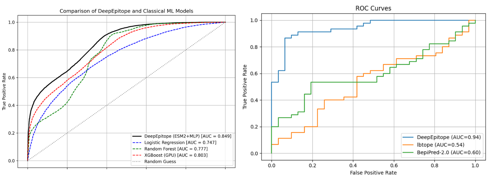

# DeepEpitope

**DeepEpitope** is a deep learning-powered tool for predicting linear B-cell epitopes from protein sequences using transformer-based protein embeddings from **ESM-2**. It enables scalable and accurate epitope discovery for cancer vaccine design and immunodiagnostics.

---

##  Features

- Uses [ESM-2](https://github.com/facebookresearch/esm) transformer embeddings
- Fully automated peptide extraction and scoring
- Customizable window sizes, thresholds, and top-N selection
- Output in both CSV and Excel formats
- Supports full-length epitope prediction mode
- GPU-accelerated (optional)

---

##  Installation

### Requirements

- Python ≥ 3.7
- PyTorch ≥ 1.10
- Transformers ≥ 4.26
- Internet connection for the first run (to download `facebook/esm2_t33_650M_UR50D`)

### Install from source

Clone and install:

```bash
git clone https://github.com/yourusername/DeepEpitope.git
cd DeepEpitope
pip install .
```

After installation, the command-line tool `DeepEpitope` becomes available.

---

## Usage

### Basic Command

```bash
DeepEpitope your_protein.fasta
```

This will:
- Extract peptides of length 8–25
- Compute ESM2 embeddings
- Predict epitope probability
- Save `epitope_predictions_all.xlsx` and top 10 epitopes in `epitope_predictions_top10.xlsx`

---

### Full Command-Line Options

| Option | Description |
|--------|-------------|
| `fasta` | **(Required)** Input multi-FASTA file with protein sequences |
| `--min_len` | Minimum peptide length (default: `8`) |
| `--max_len` | Maximum peptide length (default: `25`) |
| `--use_full_length` | Predict using full-length protein as a single peptide |
| `--threshold` | Probability cutoff (default: `0.0`) |
| `--top_n` | Number of top epitopes to retain per sequence (default: `10`) |
| `--output_prefix` | Prefix for output files (default: `epitope_predictions`) |
| `--save_csv` | Save output as `.csv` instead of `.xlsx` |
| `--batch_size` | Batch size for model inference (default: `32`) |
| `--verbose` | Show detailed logs |
| `--log_file` | Write log to a file instead of console |

---

### 🧬 Example

```bash
DeepEpitope example.fasta \
  --min_len 10 \
  --max_len 20 \
  --threshold 0.6 \
  --top_n 5 \
  --save_csv \
  --output_prefix result/output \
  --verbose
```

---

## 📂 Output

Two files are generated:

1. **`epitope_predictions_all.csv` / `.xlsx`**  
   All peptides above the threshold.

2. **`epitope_predictions_top{N}.csv` / `.xlsx`**  
   Top-N ranked peptides per input sequence.

Each row contains:

- `Header` — FASTA header
- `Rank` — Epitope rank
- `Start` / `End` — Position in the original sequence
- `Length` — Peptide length
- `Peptide` — Amino acid sequence
- `Probability` — Predicted epitope score

---

## Model Details

- Embeddings from **facebook/esm2_t33_650M_UR50D**
- Epitope classifier: fully connected PyTorch neural network
- Trained on curated epitope/non-epitope data
- Input features are 1280-dim mean embeddings
  
## Benchmarking Comparison

---

## Citation

If you use **DeepEpitope** in your research, please cite:

```bibtex
DeepEpitope: Leveraging Transformation-Based protein Embeddings for Accurate linear Cancer B-cell Epitope Identification
Dhanushkumar T, Pasupuleti Visweswara Rao, Karthick Vasudevan
doi: https://doi.org/10.1101/2025.05.23.655884

```

---

## Contributing

Contributions, feature requests, and bug reports are welcome!  
Please open an issue or pull request.

---

## 📧 Contact

For questions or collaboration, contact [karthick@ibioinformatics.org](mailto:karthick@ibioinformatics.org)
